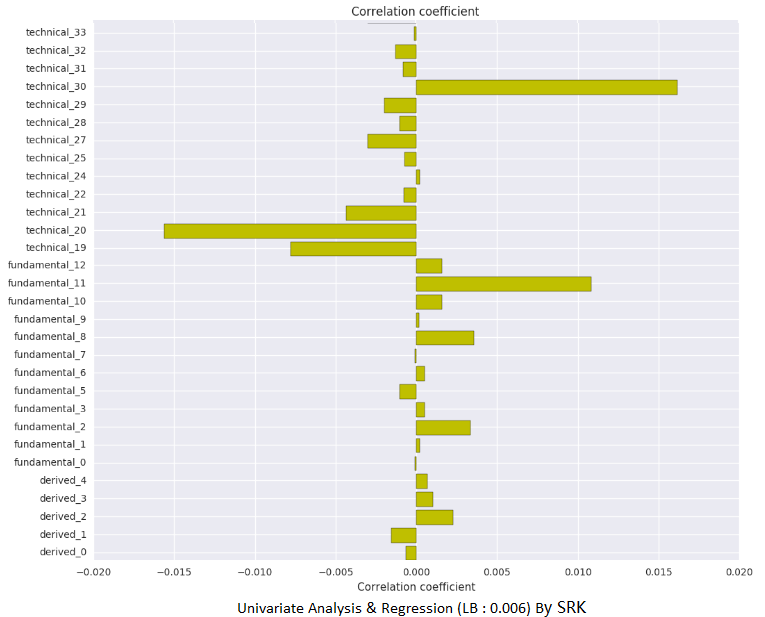
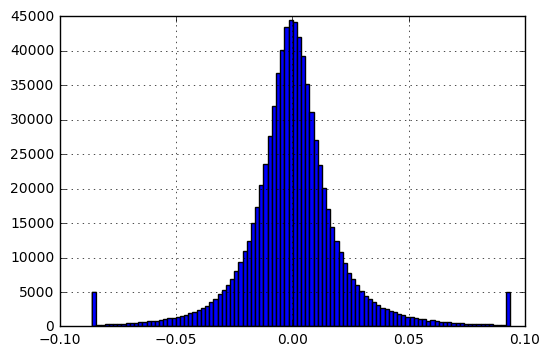

# Two Sigma Financial Modeling Challenge

On Chrismas 2016, [the1owl](https://www.kaggle.com/the1owl) very generously showed us a kernal which did a fantastic job.

The basic idea is simple, we use a bunch of models to do regression. One is linear regression and another is extra tree regression.

As to the linear regression, which is also a one-factor model, he picked the indicator technical_20, why should we use that one instead of others? Well, [antklen](https://www.kaggle.com/antklen) did a correlation analysis and showed details of the relationship between every indicator and the target, his kernal is listed here, [Correlations with target for different Id's](https://www.kaggle.com/antklen/two-sigma-financial-modeling/correlations-with-target-for-different-id-s), actually technical_20 has the largest absolute correlation with the target, that must be one essential reason. 

Now that one-factor model works so well, should we include some others indicators to make it better? Currently, the result is not that satisfying, see [am I overfitting](https://www.kaggle.com/sudalairajkumar/two-sigma-financial-modeling/am-i-over-fitting). Maybe because the 2nd and 3rd indicators didn't give a good-enough overall correlation. But it is interesting to expore on fewer indicators and exclude thoese which is almost like uncorrelated with the target. And analyze different assets with different indicators. Thus our first goal maybe to dig asset ids that gave a large absolute correlation, and analyze the best indicators for each group of assets. On the asset correlation part, this guy already did some work. [Groups of highly correlated asset's ids](https://www.kaggle.com/uditsaini/two-sigma-financial-modeling/groups-of-highly-correlated-asset-s-ids)

Another important necessary work is to clip the y values and get rid of outliers.

According to [SRK](https://www.kaggle.com/sudalairajkumar/two-sigma-financial-modeling/univariate-analysis-regression-lb-0-006), models with clipping did almost the same with training data, but greatly increased the test score from 0.06 to 0.09

